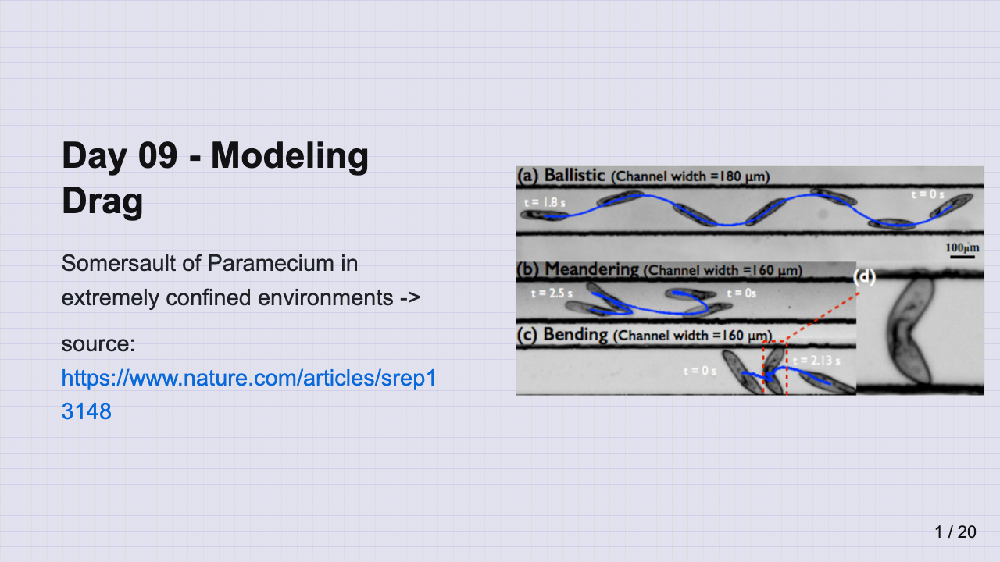
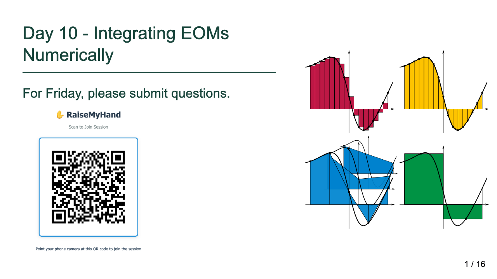
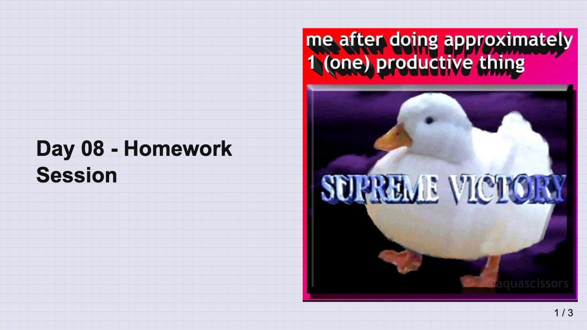
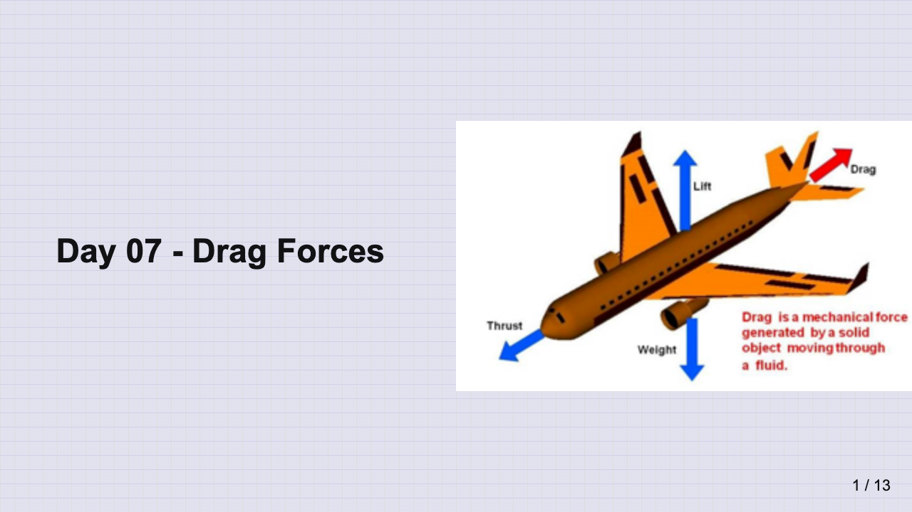
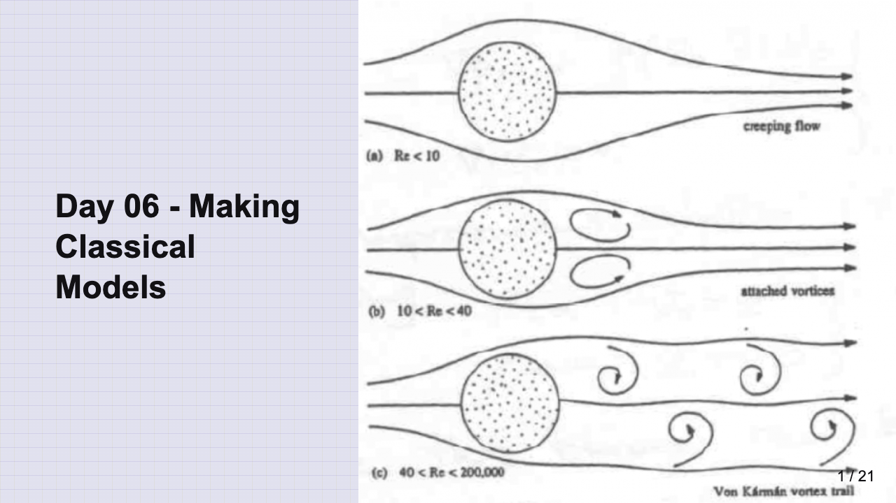
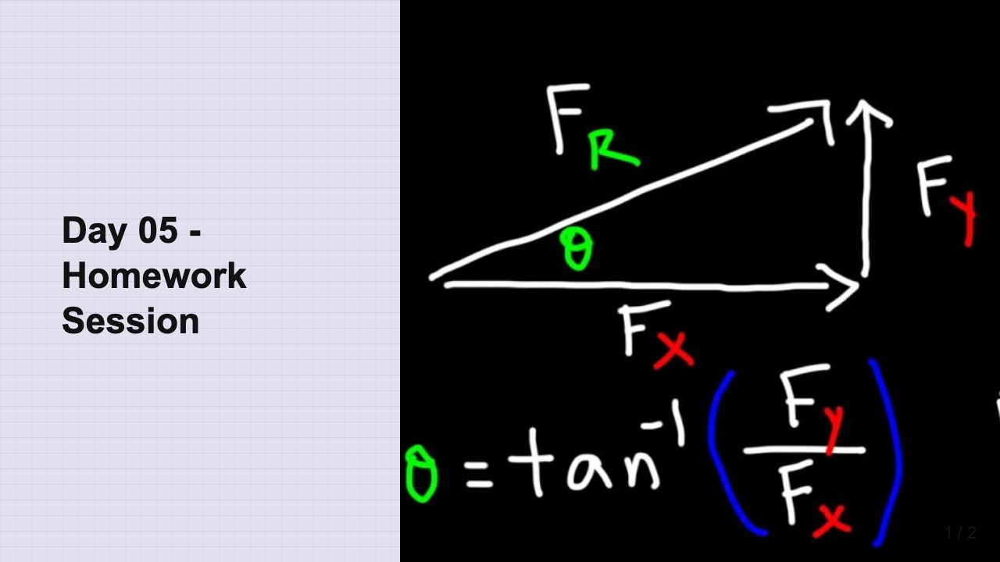
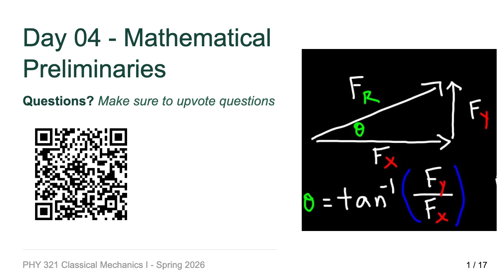
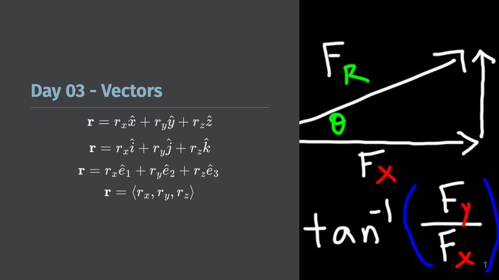
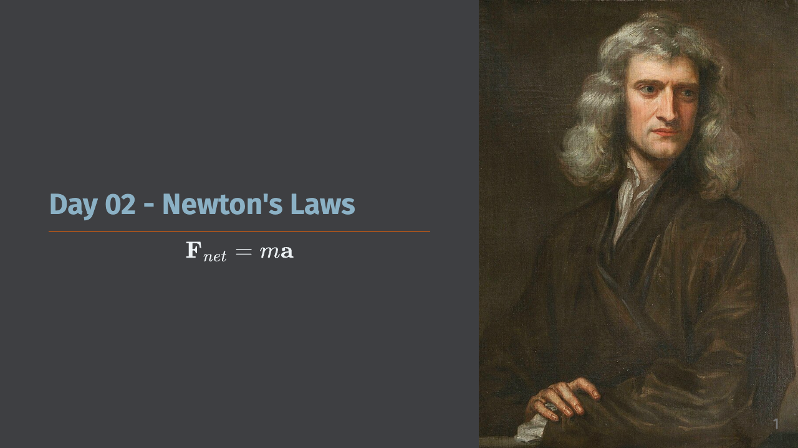
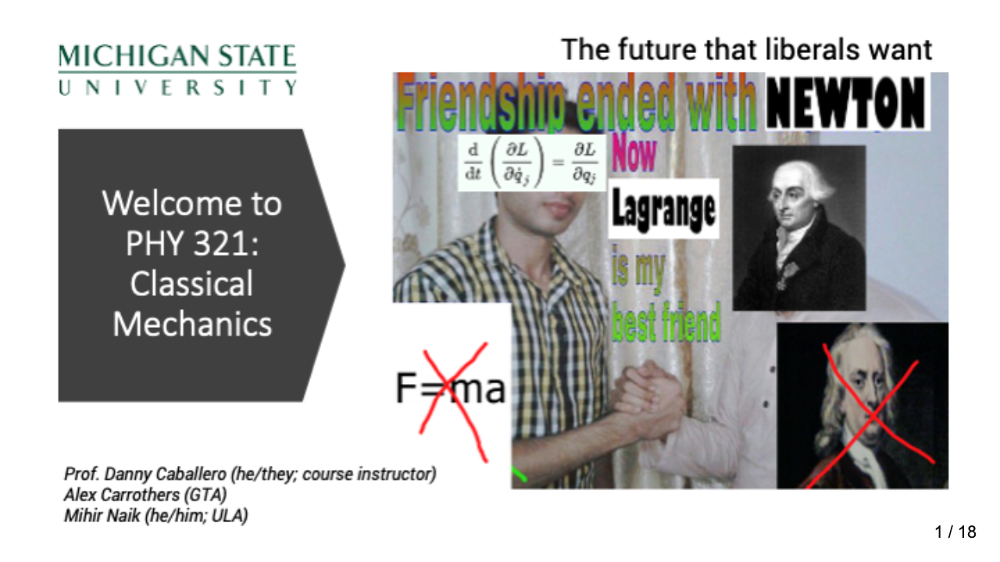

#  Course Material and Links

Materials will appear in reverse chronological order, with the most recent appearing at the top.

Class Zoom: <https://msu.zoom.us/j/92295821308>

## Class Week 5, February 10-14, 2025 (CW7)

Topics: Work, Energy, Conservative Forces

This week we begin to talk about conservation laws and dive into conservation of energy. We will discuss how energy is another useful tool for investigating physical systems and how to look at graphs of potential energy to gain insight into motion.

You should review the discussion about [Conservation Laws](../lecture-notes/week5/05_start.ipynb) and the notes on [Energy Conservation](../lecture-notes/week5/05_notes.ipynb). You should also make sure to have read JRT Ch 4.1-4.4.

## Assignments

- [Homework 4](../homeworks/hw4.ipynb) (due February 14, 2025)

### Resources

- [Conservation Laws](../lecture-notes/week5/05_start.ipynb)
- [Conservation of Energy](../lecture-notes/week5/05_notes.ipynb)
- Textbook Readings: JRT 4.1-4.4, 4.6


## Class Week 4, February 3-7, 2025 (CW6)

Topics: Fluid Resistance, Drag Forces, and Equations of Motion

This week, we start complicating our models with the addition of drag forces. We will discuss the physics of drag, cover examples that include drag forces, and learn how to set up and try to solve the equations of motion for these systems. We will extend the idea of equations of motion to two other canonical problems: central forces and the simple harmonic oscillator.

You should review the discussion about [Fluid Resistance](../lecture-notes/week4/04_start.ipynb) and the notes on [Equations of Motion](../lecture-notes/week4/04_notes.ipynb). You should also make sure to have read JRT Ch 2.1-2.4.

## Assignments

- [Homework 3](../homeworks/hw3.ipynb) (due February 7, 2025)

### Resources

- [Why does fluid drag complicate things?
](../lecture-notes/week4/04_start.ipynb)
- [Equations of Motion](../lecture-notes/week4/04_notes.ipynb)
- Textbook Readings: JRT 2.1-2.4

### Slides

03 Feb 2025 ([Slides](../slides/day-09-modeling-drag.pdf) | [Recording](https://mediaspace.msu.edu/media/1_pyvn2ffv))

05 Feb 2025 ([Slides](../slides/day-10-integrating-eoms-numerically.pdf))

## Class Week 3, January 27-31, 2025 (CW5)

Topics: Newton's Laws and Modeling Systems

This week, we begin our analysis of physical systems in earnest with Newton's Laws. We will discuss the approach of developing a mathematical model of a system, how to investigate it's equation of motion, and to make predictions about the system's behavior.

You should review the discussion about [Mathematical Modeling](../lecture-notes/week3/03_start.ipynb) and the [Newton's Laws](../lecture-notes/week3/03_notes.ipynb) notes. You should also make sure to have read JRT Ch 1.1-1.6 and AMS Ch 1-4.

### Assignments

- [Homework 2](../homeworks/hw2.ipynb) (due January 31, 2025)

### Resources 

- [Mathematical Modeling](../lecture-notes/week3/03_start.ipynb)
- [Newton's Laws](../lecture-notes/week3/03_notes.ipynb)
- Textbook Readings: JRT 1.1-1.6; AMS Ch 1-4

### Slides

31 Jan 2025 ([Slides](../slides/day-08-homework-session.pdf))

29 Jan 2025 ([Slides](../slides/day-07-drag-forces.pdf))

27 Jan 2025 ([Slides](../slides/day-06-making-classical-models.pdf))


## Class Week 2, January 20-24, 2025 (CW4)

Topics: Mathematical Preliminaries; Discrete Models

This week we will continue our discussion of the mathematics we need to investigate systems and how to begin making models. We will start talking about how to discretize the equations of motion and solve them numerically. This method called [Euler-Cromer](https://en.wikipedia.org/wiki/Semi-implicit_Euler_method) is a simple and effective way to solve many problems in physics.

You should review the overview on [Computing as a tool for science](../lecture-notes/week2/02_start.ipynb) and the [Mathematical Preliminaries](../lecture-notes/week2/02_notes.ipynb). You should keep reading JRT up to Ch 1.6 and look over AMS Ch 4.2 and Ch 5. 

### Polls to complete:

**By Monday, Jan 27, 2025**

* [AI Policy Vote](https://forms.office.com/r/PwfNQYJ2Rm)
* [Office hours scheduling](https://crab.fit/elisha-ula-office-hours-scheduling-351733)

### Assignments

- [Homework 1](../homeworks/hw1.ipynb) (due January 24, 2025)
- [Homework 2](../homeworks/hw2.ipynb) (due January 31, 2025) 

### Resources 

  - [Computing as a tool for science](../lecture-notes/week2/02_start.ipynb)
  - [Mathematical Preliminaries](../lecture-notes/week2/02_notes.ipynb)
  - Textbook Readings: JRT 1.4-1.6; AMS Ch 4.2 and 5

### Slides:

24 Jan 2025 ([Slides](../slides/day-05-homework-session.pdf))


22 Jan 2025 ([Slides](../slides/day-04-mathematical-prelims.pdf)) 



## Class Week 1, January 13-17, 2025 (CW3)

Topics: Introduction, Vectors, Kinematic Quantities

This week is an introduction to the course and a reminder on vectors, space, time, and motion. We will also discuss Python programming and how it will be used in this course. We will also discuss the software we will use in this course.

You should review the [Getting Started](../admin/getting-started.ipynb) page to learn about the course. It will direct you to other pages that will help you get started.

You should also review the first week's notes on [Classical Physics](../lecture-notes/week1/01_start.ipynb) and the [Introduction to Classical Mechanics](../lecture-notes/week1/01_notes.ipynb), or read Chapter 1.1-1.4 of JRT, Chapter 1-4 of AMS, and Chapter 3.4 of MLB. Again, these books are not required, but they are highly recommended.

Embedded in both notes pages are videos that you can watch to help you understand the concepts. We do not require you to watch these videos, but they are recommended to help you see the larger picture of what we are doing in class.

### Assignments

- [Homework 1](../homeworks/hw1.ipynb) (due January 24, 2025)

### Resources 

  - [Getting Started](../admin/getting-started.ipynb)
  - [What is Classical Physics?](../lecture-notes/week1/01_start.ipynb)
  - [Introduction to Classical Mechanics](../lecture-notes/week1/01_notes.ipynb)
  - Textbook Readings: JRT 1.1-1.4; AMS Ch 1-4; MLB 3.4

### Slides

17 Jan 2025 ([Slides](../slides/day-03-vectors.pdf))



15 Jan 2025 ([Slides](../slides/day-02-newtons-laws.pdf))


13 Jan 2025 ([Slides](../slides/day-01-introduction.pdf))



<!-- ### Zoom Playlist

All recorded classes are added to [this playlist](https://mediaspace.msu.edu/playlist/dedicated/1_s1d57uud/.) -->

<!-- ### Week 15, April 15-19, 2024

Topics: Course Review

#### Videos to Watch

##### Where do we go from here? (20 video playlist)

In this series of 1 minute videos, [Minute Physics](https://www.youtube.com/@MinutePhysics) presents some of the major conceptual elements and practical results of quantum mechanics. The next phase of classical mechanics after single particle dynamics was the development of [wave mechanics](https://en.wikipedia.org/wiki/Wave_equation), which was a precursor to [quantum mechanics](https://en.wikipedia.org/wiki/Quantum_mechanics). There's a lot of interesting physics in the classical theory of light, which lead us to the development of quantum mechanics. 

[](https://www.youtube.com/playlist?list=PL0E2ABD1D84697428)
- Non-Commercial Link: [https://inv.n8pjl.ca/playlist?list=PL0E2ABD1D84697428](https://inv.n8pjl.ca/playlist?list=PL0E2ABD1D84697428)
- Commercial Link: [https://www.youtube.com/playlist?list=PL0E2ABD1D84697428](https://www.youtube.com/playlist?list=PL0E2ABD1D84697428)

#### Class Materials
- Readings:
  - JRT Ch 1-7
- Lecture Videos:
  - 15 Apr 2024
  - 17 Apr 2024

### Week 14, April 8-12, 2024

Topics: Lagrangian Mechanics; Forces of Constraint

#### Videos to Watch

##### Solar Eclipses were terrifying (3 minute video)

We do not have class Monday; please enjoy the solar eclipse. 

[](https://youtube.com/watch?v=-oYe7xM3hLE)
- Non-Commercial Link: [https://inv.n8pjl.ca/watch?v=-oYe7xM3hLE](https://inv.n8pjl.ca/watch?v=-oYe7xM3hLE)
- Commercial Link: [https://youtube.com/watch?v=-oYe7xM3hLE](https://youtube.com/watch?v=-oYe7xM3hLE)

#### Class Materials
- Readings:
  - JRT Ch 7
- Handwritten Notes:
  - CW14: [Lagrangian Dynamics Examples](../docs/handwritten-notes/CW14.pdf)
- Notes:
  - [Lagrangian Mechanics](../lecture-notes/lagrangians.ipynb)
- Lecture Videos:
  - 8 Apr 2024 (NO CLASS; SOLAR ECLIPSE)
  - [10 Apr 2024](https://mediaspace.msu.edu/media/t/1_gjgctdk4)

### Week 13, April 1-5, 2024

Topics: Lagrangian Mechanics; Forces of Constraint

#### Videos to Watch

##### The Standard Model Lagrangian (17 minute video)

An understanding of physics formulated through [Lagrangian Mechanics](https://en.wikipedia.org/wiki/Lagrangian_mechanics) is a powerful and elegant way to describe the motion of particles and systems. But it can be much more than that. Much of the work of particle physics is done in the context of the [Standard Model](https://en.wikipedia.org/wiki/Standard_Model). The Standard Model is a theory that describes the electromagnetic, weak, and strong nuclear interactions. The Standard Model is a [quantum field theory](https://en.wikipedia.org/wiki/Quantum_field_theory), which is formulated through a Lagrangian.

The video below provides an introduction to this equation and the Standard Model.

[](https://youtube.com/watch?v=PHiyQID7SBs)
- Non-Commercial Link: [https://inv.n8pjl.ca/watch?v=PHiyQID7SBs](https://inv.n8pjl.ca/watch?v=PHiyQID7SBs)
- Commercial Link: [https://youtube.com/watch?v=PHiyQID7SBs](https://youtube.com/watch?v=PHiyQID7SBs)


#### Class Materials
- Readings:
  - JRT 7.3-7.7, 7.10
- Handwritten Notes:
  - CW13: [Lagrangian Dynamics Examples](../docs/handwritten-notes/CW13.pdf)
- Notes:
  - [Lagrangian Mechanics](../lecture-notes/lagrangians.ipynb)
- Lecture Videos:
  - [1 Apr 2024](https://mediaspace.msu.edu/media/t/1_l46sljb1)
  - [3 Apr 2024](https://mediaspace.msu.edu/media/t/1_6ychyhzy) (Screen disconnected at some point)

### Week 12, March 25-29, 2024

Topics: Lagrangian Mechanics

#### Videos to Watch

While never required, these videos are recommended to help you see the larger picture of what we are doing in class.

##### The Principle of Least Action (20 minute video)

[Newtonian Mechanics](https://en.wikipedia.org/wiki/Newton%27s_laws_of_motion) is an incredibly useful model of the natural world. In fact, it wasn't until the mid 1970s that we were able to truly [test Einstein's gravity as a true replacement](https://en.wikipedia.org/wiki/Tests_of_general_relativity) for Newton. That being said, for most terrestrial situations (macroscopic objects moving at low speeds), Newton's mechanics is very good. However, the problem with Newton is that it requires a few things:

1. We must be able identify each interaction on the object or model an average behavior from many littler interactions (e.g., models of friction vs. detailed E&M forces)
2. We must be able to mathematically describe the size and direction of the interaction at all times we want to model
3. We must be able to vectorially add the interactions to produce the net force $\sum_i \vec{F}_i = \vec{F}_{net}$.

In many cases, we can do this. But consider a bead sliding inside a cone. How would you write down the contact force between the cone and the bead for all space and time?

This is where [Lagrangian Mechanics](https://en.wikipedia.org/wiki/Lagrangian_mechanics) comes in. It is a powerful and elegant way to describe the motion of particles and systems. It is based on the [Calculus of Variations](https://en.wikipedia.org/wiki/Calculus_of_variations), a field of mathematics that is concerned with finding the path that minimizes or maximizes (called "extremization") a certain quantity. In the case of Lagrangian Mechanics, the quantity we are extremizing is the [action](https://en.wikipedia.org/wiki/Action_(physics)).

The video below discusses the concept of the Principle of Least Action, which is the foundation of Lagrangian Mechanics.

[](https://youtube.com/watch?v=Q_CQDSlmboA)
- Non-Commercial Link: [https://inv.n8pjl.ca/watch?v=Q_CQDSlmboA](https://inv.n8pjl.ca/watch?v=Q_CQDSlmboA)
- Commercial Link: [https://youtube.com/watch?v=Q_CQDSlmboA](https://youtube.com/watch?v=Q_CQDSlmboA)

##### Introduction to Lagrangian Dynamics (10 minute video)

Parth G. has a lovely video below about the basics of Lagrangian Dynamics. We will do a lot of this in class and go over many examples. This video is a nice introduction to the concept.

[](https://youtube.com/watch?v=KpLno70oYHE)
- Non-Commercial Link: [https://inv.n8pjl.ca/watch?v=KpLno70oYHE](https://inv.n8pjl.ca/watch?v=KpLno70oYHE)
- Commercial Link: [https://youtube.com/watch?v=KpLno70oYHE](https://youtube.com/watch?v=KpLno70oYHE)

#### Class Materials
- Readings:
  - JRT 7.1-7.2, 7.5; MLB 9.5
- Handwritten Notes:
  - CW12: [Introduction to Lagrangian Dynamics](../docs/handwritten-notes/CW12.pdf)
- Notes:
  - [Lagrangian Mechanics](../lecture-notes/lagrangians.ipynb)
- Lecture Videos:
  - [25 Mar 2024](https://mediaspace.msu.edu/media/t/1_zwd49u65)
  - [27 Mar 2024](https://mediaspace.msu.edu/media/t/1_p7wcsxf4)


### Week 11, March 18-22, 2024

Topics: Calculus of Variations

#### Videos to Watch

While never required, these videos are recommended to help you see the larger picture of what we are doing in class.

##### The Math of Bubbles (17 minute video)

We are eventually going to develop some deep principles of classical mechanics that will connect for us the motion of particles and the forces they experience to the energy that moves between aspects of the system. This formulation of mechanics is called [Lagrangian Mechanics](https://en.wikipedia.org/wiki/Lagrangian_mechanics). It is a powerful and elegant way to describe the motion of particles and systems. It is based on the [Calculus of Variations](https://en.wikipedia.org/wiki/Calculus_of_variations), a field of mathematics that is concerned with finding the path that minimizes or maximizes (called "extremization") a certain quantity.

This mathematics is very powerful and underlies how we can develop equations of motion in particular systems. But is also describes the shape of surfaces like bubbles and droplets. The video below is a nice introduction to the concept of Calculus of Variations and it's relation to [minimal surfaces](https://en.wikipedia.org/wiki/Minimal_surface).

[](https://youtube.com/watch?v=8SABptOYUVk)

- Non-Commercial Link: [https://inv.n8pjl.ca/watch?v=8SABptOYUVk](https://inv.n8pjl.ca/watch?v=8SABptOYUVk)
- Commercial Link: [https://youtube.com/watch?v=8SABptOYUVk](https://youtube.com/watch?v=8SABptOYUVk)

#### Class Materials
- Readings:
  - JRT 6.1-6.3; MLB 9.1-9.4
- Handwritten Notes:
  - CW11: [Calculus of Variations](../docs/handwritten-notes/CW11.pdf)
- Lecture Videos:
  - [18 Mar 2024](https://mediaspace.msu.edu/media/t/1_rr109ryy)
  - [20 Mar 2024](https://mediaspace.msu.edu/media/t/1_dat6u1eo)

### Week 10, March 11-15, 2024

Topics: Fourier Series Expansions

#### Videos to Watch

While never required, these videos are recommended to help you see the larger picture of what we are doing in class.

##### The Fast Fourier Transform (FFT) (26 minute video)

We will be learning the analytical methods used to decompose periodic signals. The [Fourier Series](https://en.wikipedia.org/wiki/Fourier_series) is a mathematical tool that allows us to decompose periodic signals into a sum of sines and cosines. It is a super important tool in physics and engineering. 

But, this kind of signal decomposition is a critical tool in many modern areas of research. In the time since Fourier's original work, the field has expanded to include other series, as well as development like the [Fourier Transform](https://en.wikipedia.org/wiki/Fourier_transform) and the incredibly useful [Fast Fourier Transform](https://en.wikipedia.org/wiki/Fast_Fourier_transform) (FFT). The FFT is a computational algorithm that allows us to compute Fourier Transforms very quickly and it has been one of the most important algorithms in the history of computing. It is used in a wide variety of applications, including signal processing, image processing, and data compression.

The video below describes the concept and history of the FFT and its importance.

[](https://youtube.com/watch?v=nmgFG7PUHfo)

- Non-Commercial Link: [https://inv.n8pjl.ca/watch?v=nmgFG7PUHfo](https://inv.n8pjl.ca/watch?v=nmgFG7PUHfo)
- Commercial Link: [https://youtube.com/watch?v=nmgFG7PUHfo](https://youtube.com/watch?v=nmgFG7PUHfo)

#### Class Materials
- Readings:
  - JRT 5.7; MLB 7.3-7.5
- Handwritten Notes:
  - CW10: [Fourier Series](../docs/handwritten-notes/CW10.pdf)
- Lecture Videos:
  - [11 Mar 2024](https://mediaspace.msu.edu/media/t/1_wtepzqw0)
  - [13 Mar 2024](https://mediaspace.msu.edu/media/t/1_fk8a37u1)
  - [15 Mar 2024](https://mediaspace.msu.edu/media/t/1_g79z705y)

### Week 9, March 4-8, 2024

Topics: Damped Driven Oscillations, Resonance

#### Videos to Watch

While never required, these videos are recommended to help you see the larger picture of what we are doing in class.

##### Collapse of the Tacoma Narrows Bridge (9 minute video)

Driven oscillators are very common in the world. Analog radios use a driven oscillator that is tuned to a specific frequency (99.5 FM is tuned to 99.5 MHz). When you dial the radio you are "tuning" the oscillator to the frequency of the broadcast. This is an illustration of the phenomenon of [resonance](https://en.wikipedia.org/wiki/Resonance). Resonance is a phenomenon where a system is driven at a frequency that matches (or closely matches) its natural frequency. When this happens, the amplitude of the oscillation can grow very large. This is the phenomenon that caused the [collapse of the Tacoma Narrows Bridge](https://en.wikipedia.org/wiki/Tacoma_Narrows_Bridge_(1940)) in 1940.  T

The video below describes the collapse and how the bridge was rebuilt to avoid the same problem. 

[](https://youtube.com/watch?v=mXTSnZgrfxM)

- Non-Commercial Link: [https://inv.n8pjl.ca/watch?v=mXTSnZgrfxM](https://inv.n8pjl.ca/watch?v=mXTSnZgrfxM)
- Commercial Link: [https://youtube.com/watch?v=mXTSnZgrfxM](https://youtube.com/watch?v=mXTSnZgrfxM)

#### Class Materials
- Readings:
  - JRT 5.5-5.6; MLB 8.6
- Handwritten Notes:
  - CW9: [Damped Driven Oscillations](../docs/handwritten-notes/CW9.pdf)
- Lecture Videos:
  - [4 Mar 2024](https://mediaspace.msu.edu/media/t/1_qj6wzo83)
  - 6 Mar 2024 - Homework Help Session
  - [8 Mar 2024](https://mediaspace.msu.edu/media/t/1_p8cll95m)


### Week 8, February 26-March 1, 2024

SPRING BREAK

### Week 7, February 19-23, 2024

Topics: Oscillations

#### Videos to Watch

While never required, these videos are recommended to help you see the larger picture of what we are doing in class. 


##### Synchronization (21 minute video)

How do fireflies end up blinking together? How do walking people end up moving in step? How does your heart physically push blood through your body? Each of these questions has to do with the physics of [synchronization](https://en.wikipedia.org/wiki/Synchronization). There's a lot of interesting physics in this space. The phenomenon of synchronization is rooted in the physics of [oscillations](https://en.wikipedia.org/wiki/Oscillation) and [waves](https://en.wikipedia.org/wiki/Wave). When oscillators couple (or influence each other), we begin to see behavior that is more complex than the sole oscillator. These "coupled oscillators" can demonstrate a wide variety of behaviors, including synchronization. They also form the basis for important technologies like [lasers](https://en.wikipedia.org/wiki/Laser) and [radio transmitters](https://en.wikipedia.org/wiki/Radio_transmitter).

 We will begin our study of oscillations with the [simple harmonic oscillator](https://en.wikipedia.org/wiki/Simple_harmonic_motion) and then move to more complex systems (e.g., [the Duffing oscillator](https://en.wikipedia.org/wiki/Duffing_equation)).

 The video below is a good introduction to the topic of synchronization. 

[](https://youtube.com/watch?v=t-_VPRCtiUg)

- Non-Commercial Link: [https://inv.n8pjl.ca/watch?v=t-_VPRCtiUg](https://inv.n8pjl.ca/watch?v=t-_VPRCtiUg)
- Commercial Link: [https://youtube.com/watch?v=t-_VPRCtiUg](https://youtube.com/watch?v=t-_VPRCtiUg)

#### Class Materials
- Readings:
  - JRT 5.1-5.2, 5.4; MLB 7.1-7.2; 8.5
- Handwritten Notes:
  - CW7: [Oscillations](../docs/handwritten-notes/CW7.pdf)
- Lecture Videos:
  - [19 Feb 2024](https://mediaspace.msu.edu/media/t/1_n90d2mj6)
  - [21 Feb 2024](https://mediaspace.msu.edu/media/t/1_j6ltnm1h)

#### Assignments

- [Homework 5](../homeworks/hw5.ipynb) (due March 8, 2024)
- [Midterm 1](../midterms/midterm1.ipynb) (due February 23, 2024)

### Week 6, February 12-16, 2024

Topics: Phase Space and Non-Linear Dynamics

#### Videos to Watch

While never required, these videos are recommended to help you see the larger picture of what we are doing in class. 


##### Numerical Integration 

[Numerical Integration](https://en.wikipedia.org/wiki/Numerical_integration) is a vast and wide topic with lots of different approaches, important nuances, and difficult problems. Some of the most high profile numerical integration was done by NASA's [human computers](https://education.nationalgeographic.org/resource/women-nasa) -- a now well-known story thanks to the film [Hidden Figures](https://en.wikipedia.org/wiki/Hidden_Figures). Black women formed a core group of these especially talented scientists (including [Mary Jackson](https://en.wikipedia.org/wiki/Mary_Jackson_(engineer)), [Katherine Johnson](https://en.wikipedia.org/wiki/Katherine_Johnson), and [Dorothy Vaughn](https://en.wikipedia.org/wiki/Dorothy_Vaughan)), without whom, John Glenn would not have orbited the Earth in 1962. This is also a very interesting story about the importance of [Historically Black Colleges and Universities](https://en.wikipedia.org/wiki/Historically_black_colleges_and_universities) to American science.

Below is a video describing 3 coupled ODEs, the [Lorenz equations](https://en.wikipedia.org/wiki/Lorenz_system), that are quite famous. You will be able to model systems like this, but for now think of it as motivation for why we want to learn numerical integration.

[)](https://inv.n8pjl.ca/watch?v=aAJkLh76QnM)
- Non-Commercial Link: [https://inv.n8pjl.ca/watch?v=aAJkLh76QnM?](https://inv.n8pjl.ca/watch?v=aAJkLh76QnM?)
- Commercial Link: [https://youtube.com/watch?v=aAJkLh76QnM?](https://youtube.com/watch?v=aAJkLh76QnM?)

##### Geometric Thinking and Phase Portraits

One of the first things we will use to investigate systems from a dynamical systems perspective is the [phase portrait](https://en.wikipedia.org/wiki/Phase_portrait), where we will plot the velocity against the position. We can use the phase portrait to tell us what families of solutions we might expect to see. 

*Phase portraits are quite useful for second order differential equations (or any two-dimensional system) because we frequently use and interpret 2D graphs.* Notice that we focused on "2nd order differential equations" not "linear 2nd order." That is because, as we will see, **phase portraits are particularly useful for nonlinear 2nd order differential equations.**

We will go into the details of how to construct and develop phase portraits in class. This video from [Steve Brunton](https://www.me.washington.edu/facultyfinder/steve-brunton) is a good overview of the process. It's quite detailed and takes a mathematical perspective, so don't worry if you don't understand everything in the video. We have plenty of time to investigate how this works in practice.

[](https://youtube.com/watch?v=vBwyD4JJlSs)

- Non-Commercial Link: [https://inv.n8pjl.ca/watch?v=vBwyD4JJlSs](https://inv.n8pjl.ca/watch?v=vBwyD4JJlSs)
- Commercial Link: [https://youtube.com/watch?v=vBwyD4JJlSs](https://youtube.com/watch?v=vBwyD4JJlSs)

#### Class Materials
- Readings:
  - [Strogatz](https://www.stevenstrogatz.com/books/nonlinear-dynamics-and-chaos-with-applications-to-physics-biology-chemistry-and-engineering) [2.0-2.3](../docs/textbook-chapters/strogatz_3rd_ch2.0-2.3.pdf); [5.0-5.2](../docs/textbook-chapters/strogatz_3rd_ch5.0-5.2.pdf) 
- Additional Readings:
  - [Newman's Computational Physics - Ch8 - Solving ODEs](../docs/textbook-chapters/Newman_Ch8_ODEs.pdf)
  - [Cromer's original paper on the Euler-Cromer method](../docs/papers/euler_cromer_1981.pdf)
- Handwritten Notes:
  - CW6: [Phase Space and Nonlinear Dynamics](../docs/handwritten-notes/CW6.pdf)
- Lecture Videos:
  - [12 Feb 2024](https://mediaspace.msu.edu/media/t/1_pa3afrh5)
  - [14 Feb 2024](https://mediaspace.msu.edu/media/t/1_zlcyf858)

#### Assignments

- [Midterm 1](../midterms/midterm1.ipynb) (due February 23, 2024)


### Week 5, February 5-9, 2024

Topics: Conservative Forces, Potential Energy, Stability

#### Videos to Watch

While never required, these videos are recommended to help you see the larger picture of what we are doing in class. 

##### Where do we think mass comes from? (13 minute video)

The [Higgs Boson](https://en.wikipedia.org/wiki/Higgs_boson) is a particle that was discovered in 2012 at the [Large Hadron Collider](https://en.wikipedia.org/wiki/Large_Hadron_Collider) at [CERN](https://en.wikipedia.org/wiki/CERN). This discovery was a major milestone in the field of particle physics. Much of what we are trying to understand about the nature of mass is encapsulated in the [Higgs Field](https://en.wikipedia.org/wiki/Higgs_field). This is an advanced field with a potential that we are not intending to explore. However, the importance of the basic question of "where does mass come from?" is a fundamental question in physics and the concept of energy, potential, and fields is a critical part of the answer.

[](https://youtube.com/watch?v=R7dsACYTTXE)

- Non-Commercial Link: [https://inv.n8pjl.ca/watch?v=R7dsACYTTXE](https://inv.n8pjl.ca/watch?v=R7dsACYTTXE)
- Commercial Link: [https://youtube.com/watch?v=R7dsACYTTXE](https://youtube.com/watch?v=R7dsACYTTXE)


#### Class Materials
- Readings:
  - JRT 4.1-4.4, 4.6; MLB 6.6-6.8
- Handwritten Notes:
  - CW5: [Potential Energy](../docs/handwritten-notes/CW5.pdf)
- Lecture Videos:
  - [5 Feb 2024](https://mediaspace.msu.edu/media/t/1_womzepbu)
  - [7 Feb 2024](https://mediaspace.msu.edu/media/t/1_xwyxkt7m)

#### Assignments

- [Homework 4](../homeworks/hw4.ipynb) (due February 9, 2024)

### Week 4, January 29-February 2, 2024

Topics: Work-Energy Theorem, Conservative Forces, Momentum Conservation

#### Videos to Watch

While never required, these videos are recommended to help you see the larger picture of what we are doing in class. 

##### Feynman on the units of energy (2 minute video)

[Richard Feynman](https://en.wikipedia.org/wiki/Richard_Feynman) was a Nobel Prize winning physicist who was known for his ability to explain complex ideas in simple terms. In this video, he explains the units of energy. He's engaging and gregarious as he was known publicly. 

[](https://youtube.com/watch?v=roX2NXDUTsM)

- Non-Commercial Link: [https://inv.n8pjl.ca/watch?v=roX2NXDUTsM](https://inv.n8pjl.ca/watch?v=roX2NXDUTsM)
- Commercial Link: [https://youtube.com/watch?v=roX2NXDUTsM](https://youtube.com/watch?v=roX2NXDUTsM)

```{note}
While we acknowledge the importance of Feynman's contributions to physics and physics teaching, we should remind ourselves that he was not a perfect person. 

Feynman was also known for his [sexist behavior and comments](https://caltechletters.org/viewpoints/feynman-harassment-science). (*Trigger warning*: this link recounts instances of harassment) 

We should not ignore this aspect of his life, and remind ourselves that we can learn from his physics, and make a welcoming space for all people.
```

##### How does electricity work? (15 minute video)

Energy is a fundamental concept in physics, but it is also a very abstract concept. Feynman is quoted as saying: "*It is important to realize that in physics today, we have no knowledge of what energy is.*" 

It's a number a quantity, that when we compute it, we find it stays the same before and after a process - so long as we account for all the interactions and uses in that case. 

To frame how interesting and complex energy can be, consider this video from the [Veritasium channel](https://inv.n8pjl.ca/channel/UCHnyfMqiRRG1u-2MsSQLbXA). [[Commerical Link](https://www.youtube.com/channel/UCHnyfMqiRRG1u-2MsSQLbXA)]

*How do we get light from a circuit when we close a switch?*

[](https://youtube.com/watch?v=bHIhgxav9LY)

- Non-Commercial Link: [https://inv.n8pjl.ca/watch?v=bHIhgxav9LY](https://inv.n8pjl.ca/watch?v=bHIhgxav9LY)
- Commercial Link: [https://youtube.com/watch?v=bHIhgxav9LY](https://youtube.com/watch?v=bHIhgxav9LY)

#### Class Materials
- Readings:
  - JRT 4.1-4.3; JRT 3.1-3.4
- Handwritten Notes:
  - CW4: [Conservation Laws](../docs/handwritten-notes/CW4.pdf)
- Lecture Videos:
  - [29 Jan 2024](https://mediaspace.msu.edu/media/t/1_0of138eb)
  - [31 Jan 2024](https://mediaspace.msu.edu/media/t/1_m3w1c61k)

#### Assignments

- [Homework 3](../homeworks/hw3.ipynb) (due February 2, 2024)


### Week 3, January 22-26, 2024

Topics: Modeling with Newton's Second Law, Motion in 2D, Drag Forces

#### Videos to Watch

While never required, these videos are recommended to help you see the larger picture of what we are doing in class. These two focus on the physics of low [Reynolds number](https://en.wikipedia.org/wiki/Reynolds_number) flows.  

##### Physics of Life - Life at Low Reynolds Number (15 minute video)

This video focuses on the biological aspects of the problem as the physics of low Reynolds numbers is important for understanding the motion of microorganisms. 
[](https://youtube.com/watch?v=gZk2bMaqs1E)

- Non-Commercial Link: [https://inv.n8pjl.ca/watch?v=gZk2bMaqs1E](https://inv.n8pjl.ca/watch?v=gZk2bMaqs1E)
- Commercial Link: [https://youtube.com/watch?v=gZk2bMaqs1E](https://youtube.com/watch?v=gZk2bMaqs1E)

##### G.I. Taylor's Low Reynolds Number Flows (32 minute video)

This video is a classic from [G.I. Taylor](https://en.wikipedia.org/wiki/Geoffrey_Ingram_Taylor) who was a physicist interested in sharing the conceptual beauty of physics with the general public. He was also a pioneer in the field of fluid mechanics. In fact, Taylor's [groundbreaking paper](https://royalsocietypublishing.org/doi/10.1098/rsta.1923.0008) on the stability of fluid flows between two rotating cylinders set off studies into turbulence. The [Taylor-Couette flow](https://en.wikipedia.org/wiki/Taylor%E2%80%93Couette_flow) is a critical tool for [studies of turbulence](https://pubmed.ncbi.nlm.nih.gov/20365623/).

[](https://youtube.com/watch?v=8Dst6V4CQME)

- Non-Commercial Link: [https://inv.n8pjl.ca/watch?v=8Dst6V4CQME](https://inv.n8pjl.ca/watch?v=8Dst6V4CQME)
- Commercial Link: [https://youtube.com/watch?v=8Dst6V4CQME](https://youtube.com/watch?v=8Dst6V4CQME)

#### Class Materials
- Readings:
  - JRT 2.1-2.4
- Handwritten Notes:
  - CW3: [Forces and Motion](../docs/handwritten-notes/CW3.pdf)
- Lecture Videos:
  - [22 Jan 2024](https://mediaspace.msu.edu/media/t/1_injjcj1y)
  - [24 Jan 2024](https://mediaspace.msu.edu/media/t/1_p43v9u78) - no audio first 27 minutes...

#### Assignments

- [Homework 2](../homeworks/hw2.ipynb) (due January 26, 2024)

### Week 2, January 16-19, 2024

Topics: Modeling with Newton's Second Law, Motion in 1D

#### Web Resources
  - [What is Mathematical Modeling?](../lecture-notes/chapter2-overview.ipynb)
  - [Classical Mechanics, Mathematics, and Numerical background](../lecture-notes/chapter2.ipynb)

#### Class Materials
- Readings:
  - JRT 1.4-1.6; AMS Ch 4.2 and Ch 5
- Handwritten Notes:
  - CW1: [Making Classical Models](../docs/handwritten-notes/CW2.pdf)
- Lecture Videos:
  - 17 Jan 2024 (ipad crashed zoom)

#### Assignments

- [Homework 2](../homeworks/hw2.ipynb) (due January 26, 2024) -->


