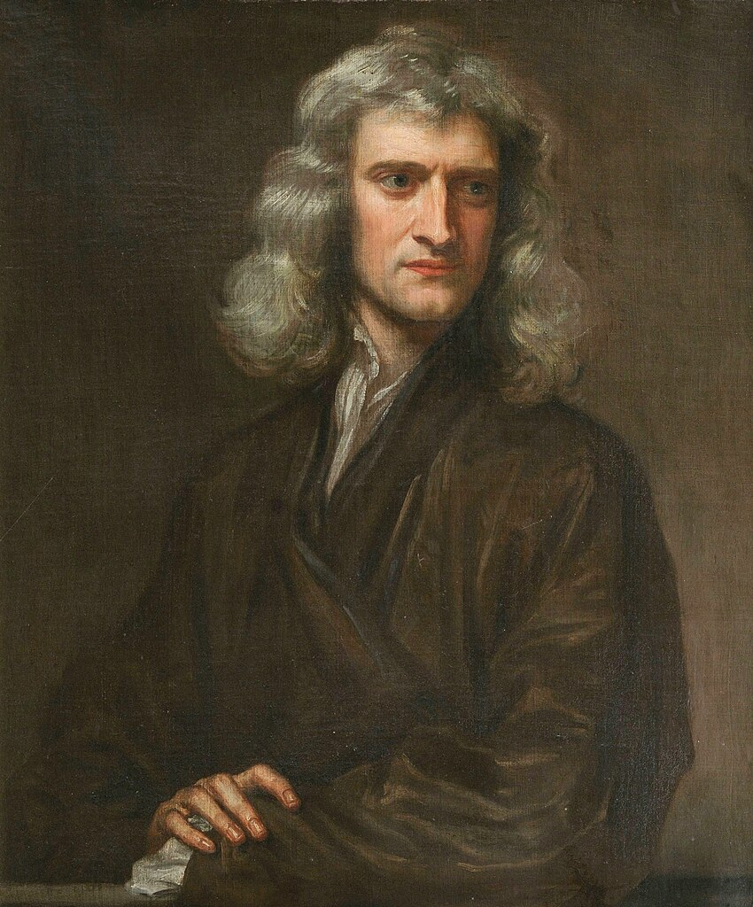
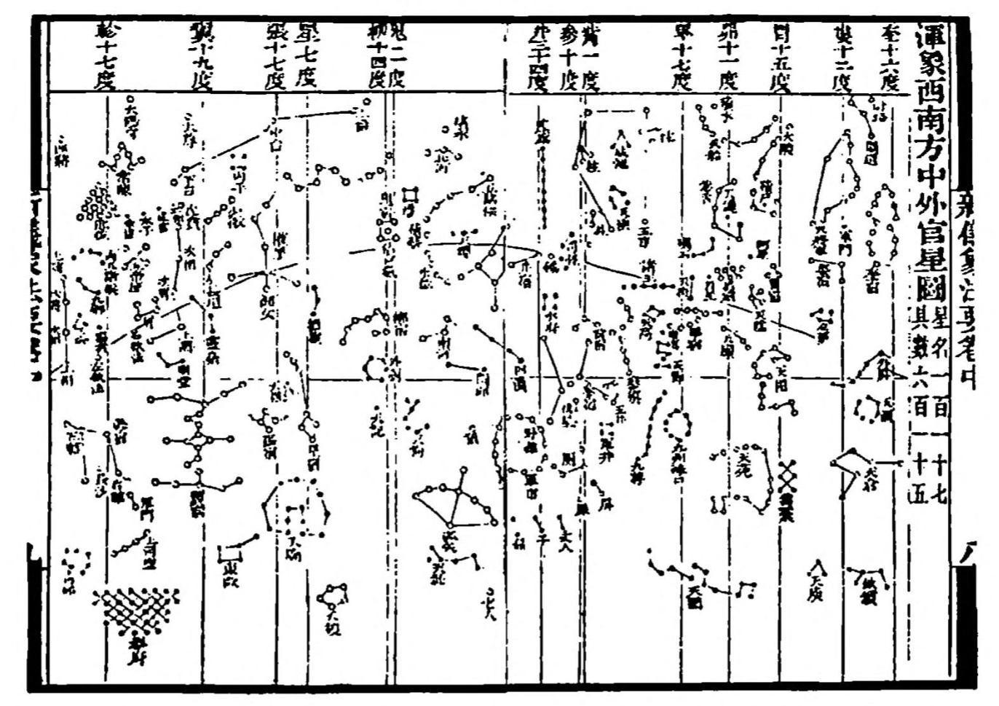
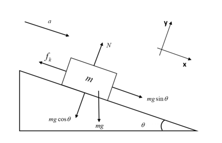

# Day 02 - Newton's Laws

$$\mathbf{F}_{net} = m \mathbf{a}$$

**Not shown in this picture of Newton are the countless illiterate mechanics and farmers, immigrant laborers, indigenous scholars, and other non elite members of society upon whose backs and accomplishments Newton's Principia was written.**

---

# Announcements

* Homework 1 is due next Friday
* Help sessions will start next week
    * Complete the student information survey; help session survey
* Friday's class will include AI policy discussion
    * We will get folks started with VS Code
    * We will also work Homework 1 Exercise 3 together
* DC aware of Gradescope issues; let's check in Friday.
---

# Goals for this week

## Be able to answer the following questions.

* What is Classical Mechanics?
* How can we formulate it?
* What are the essential physics models for single particles?
* What mathematics do we need to get started?

---

 
 

## Take 2 min to write down what comes to mind when asked:
 

## What is "Classical" Physics?

---

# Classical Mechanics

## Modeling large, slow-moving objects

Newton's Laws are but one of a number of formulations:
* Lagrangian Mechanics
* Hamiltonian Mechanics
* Dynamical Systems Theory
* ...

---

<!-- _backgroundColor: DodgerBlue -->
# An Overview of Different Physics

--- 

### Classical Mechanics has a long history

> Wherever folks were figuring out their world, there was classical mechanics

- [Astronomical analyses in Sub-Saharan Africa](https://www.science.org/doi/10.1126/science.200.4343.766) in 300 BCE
- [Scientific expansion in China](https://en.wikipedia.org/wiki/Science_and_technology_of_the_Song_dynasty) during the Song dynasty
- [The Islamic Golden Age](https://en.wikipedia.org/wiki/Islamic_Golden_Age) 
- [Indigenous astronomy](https://en.wikipedia.org/wiki/Indigenous_astronomy)

---

### Classical Mechanics is still very relevant

Tiny Limbs and Long Bodies: Coordinating Lizard Locomotion
[Research Lab](https://research.gatech.edu/tiny-limbs-and-long-bodies-coordinating-lizard-locomotion) 

Source: <https://youtu.be/Qme07fA3Fj4>

---

# Canonical Example from Introductory Physics

- Box on a ramp with a frictional interaction
- At what angle does it slide for a given $\mu_s$?

---

## Think-Pair-Share

We used a tilted coordinate system ($x-y$ plane) to analyze the motion of a block on an inclined plane. How can we check that we did the gravitational force decomposition correctly?

Recall:
* $F_{\text{gravity}},x = m g \sin(\theta)$
* $F_{\text{gravity}},y = m g \cos(\theta)$

Come up with at least two checks.

---

## Clicker Question 2-1

The formal definition of a Taylor series expansion around a point $a$ is:

$$f(x) = f(a) + f'(a)(x-a) + \frac{f''(a)}{2!}(x-a)^2 + \frac{f'''(a)}{3!}(x-a)^3 + \ldots$$

This formula makes me feel:

1. Confident, I got this.
2. A little nervous, but I think I remember.
3. Uncomfortable, I don't remember this.
4. I have no idea what this is.

---

## Think-Pair-Share

We derived the following differential equation for the falling ball in one-dimension:

$$\frac{d^2 y}{dt^2} = +g - \frac{b}{m} \frac{dy}{dt} - \frac{c}{m} \left(\frac{dy}{dt}\right)^2$$

Let's assume the turbulent drag term is negligible. Is there an anti-derivative of the right-hand side of this equation? If so, what is it?

$$\frac{dv}{dt} = +g - \frac{b}{m}v$$

--- 

# Example: Ball Falling in 1D in Air

We derived the following differential equation for the motion of a ball falling in air:

$$m\ddot{y} = mg - b v - c v^2$$

We argued for low speeds, we neglect the $v^2$ term. 

$$m\ddot{y} = mg - b v$$

We can instead write this differential equation for $v$:

$$\dot{v} = g - \frac{b}{m}v$$

---

# Example: Ball Falling in 1D in Air

Is this integrable? **Yes!**

$$\frac{dv}{dt} = g - \frac{b}{m}v$$

$$\frac{dv}{g - \frac{b}{m}v} = dt$$

$$\int \frac{dv}{g - \frac{b}{m}v} = \int dt$$

We will come back to this next week.

---

# Vector Properties

Newtonian Mechanics is a vector theory. Here are a few mathematical properties of vectors:

* **Addition**: $\mathbf{A} + \mathbf{B} = (A_x + B_x)\hat{x} + (A_y + B_y)\hat{y} + (A_z + B_z)\hat{z}$
* **Scalar Multiplication**: $c\mathbf{A} = \langle cA_x, cA_y, cA_z\rangle$
* **Dot Product**: $\mathbf{A}\cdot\mathbf{B} = A_xB_x + A_yB_y + A_zB_z = AB\cos\theta$
* **Cross Product**: $\mathbf{A}\times\mathbf{B} = \langle A_yB_z - A_zB_y, A_zB_x - A_xB_z, A_xB_y - A_yB_x\rangle$
* **Unit Vectors**: $\hat{A} = \frac{\mathbf{A}}{|\mathbf{A}|} \qquad |\hat{A}| = 1$