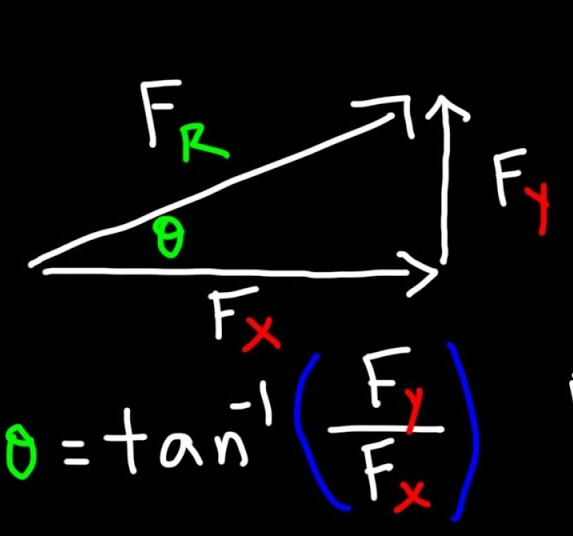

<!--
_class: title
_backgroundColor: #ffffff
_color: #18453B
-->

# Day 04 - Mathematical Preliminaries

**Questions?** *Make sure to upvote questions*

PHY 321 Classical Mechanics I - Spring 2026

---

# RaiseMyHand

- Tool should be available for each class period. 
- Answers to your questions are also written up after class
  - Day 02 - <https://raisemyhand.msucerl.org/student?code=s97Hf7-WS9K7b7ooovdjKxXwih1b_Nnj>
- Links to each day posted in MS Teams

*Would appreciate your feedback and/or ideas for use cases*

---

# Announcements

* Homework 1 is due this Friday
* Homework 2 is posted now
* Help sessions start this week
    * DC - Fridays at 10:00-12:00 and 16:00-17:00 (1248 BPS)
* Mihir (ULA) will host additional help hours soon

---

# Seminars this week 

## WEDNESDAY, January 21, 2026    
 
Astronomy Seminar, 1:30 p.m., BPS 1400 & Zoom 
Speaker: Yuan Li, UMass - Amherst
Title: TBA
Zoom Link: https://msu.zoom.us/j/93334479606?pwd=OtIXPWhRPBfzYu53sl3trSJlaBYI7C.1
Passcode:  825824
 
---
 
# Seminars this week 

## THURSDAY, January 22, 2026    
 
Colloquium, Seminar, 3:30 p.m., BPS 1415 & Zoom
Refreshments at 3:00 BPS in BPS 1400
Speaker:  Richard Lenski, MSU
Title: Dynamics and Repeatability of Evolution in a Long-Term Experiment with Bacteria 
Zoom Link: https://msu.zoom.us/j/94951062663
Password: 2002
 
---

# Seminars this week 

## FRIDAY, January 23, 2026    
 
QuIC, Seminar, 12:40 p.m., BPS 1300 & Zoom 
Speaker: Ben DalFavero, MSU
Title: Fault tolerant quantum computing I

---

# Goals for this week

## Be able to answer the following questions.

* What are the essential physics models for single particles?
* How do we setup problems in classical mechanics?
* What mathematics do we need to get started?
* How do we solve the equations of motion?

---

# Reminders from Day 03

* In a Newtonian world, we start from a vector description of motion
* Differential equations are mathematical models that describe the motion of particles
* We can use different methods to solve these differential equations

**i-Clicker: https://join.iclicker.com/PRJO**

--- 

# Clicker Question 4-1

**I feel confident in my abilities to use VS Code for my homework**

1. Strongly Agree
2. Agree
3. We'll see
4. Disagree
5. Strongly disagree

---

# Projectile Motion

$$\mathbf{a} = \langle a_x, a_y \rangle$$

$$x_f = x_i + v_{x,i}t + \dfrac{1}{2}a_x t^2$$

$$y_f = y_i + v_{y,i}t + \dfrac{1}{2}a_y t^2$$

---

# Clicker Question 4-2

For this fountain, what is the best guess for the acceleration ($\mathbf{a} = ??$) experienced by a fluid particle?   *Assume $y$ is positive upward; $x$ is positive to the right.*

1. $a_x \neq 0, a_y = g$
2. $a_x = 0, a_y = g$
3. $a_x \neq 0, a_y = -g$
4. $a_x = 0, a_y = -g$
5. Something else

---

# Clicker Question 4-3

**I feel comfortable with a discrete formulation of Newton's Laws.**

1. Yes, I got this.
2. I recall some ideas, but let's check in.
3. I'm not sure.
4. I really don't know what *discrete formulation* means here
5. ???

---

# Clicker Question 4-4

The average velocity for a macroscopic time step $\Delta t = t_f - t_i$ is given by:

$$\mathbf{v}_{avg} = \dfrac{\Delta \mathbf{r}}{dt}$$

where $\Delta \mathbf{r} = \mathbf{r}_f - \mathbf{r}_i$. At what time do we estimate the average velocity occurs?

1. $t_i$
2. $t_f$
3. Sometime between $t_f$ and $t_i$
4. $\dfrac{t_f-t_i}{2}$

---

# Clicker Question 4-5

**I feel comfortable with vectors, vector decomposition, and trigonometry in Cartesian coordinates.**

1. Yes, I got this.
2. I recall some ideas, but let's check in.
3. I'm not sure.
4. I don't feel too confident with vectors.

---

# Clicker Question 4-6

Consider the generic position vector $\vec{R}$ for a particle in 2D space. Which of the following describes the direction of the vector in plane polar coordinates ($r$, $\phi$)?

1. $\hat{R}$
2. $\hat{r}$
3. $\hat{\phi}$
4. Some combination of $\hat{r}$ and $\hat{\phi}$
5. I'm not sure.

---

# Group Discussion 4-1

We found the following expression for the equation of motion of a falling ball subject to air resistance:

$$m \ddot{y} = +mg - b \dot{y} - c \dot{y}^2$$

What are the units of the constants $b$ and $c$?

---

# Group Discussion 4-2

Consider the generic position vector $\vec{R}$ for a particle in 2D space. Find the velocity vector $\vec{V}$ for the particle in Cartesian coordinates ($x$, $y$).

**What happens in plane polar coordinates?** 

$$\vec{R} = r \hat{r} + \phi \hat{\phi}$$

Note: 

$$\hat{r} = \cos(\phi) \hat{x} + \sin(\phi) \hat{y}$$

$$\hat{\phi} = -\sin(\phi) \hat{x} + \cos(\phi) \hat{y}$$

