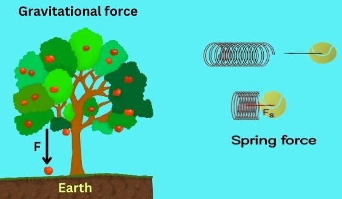
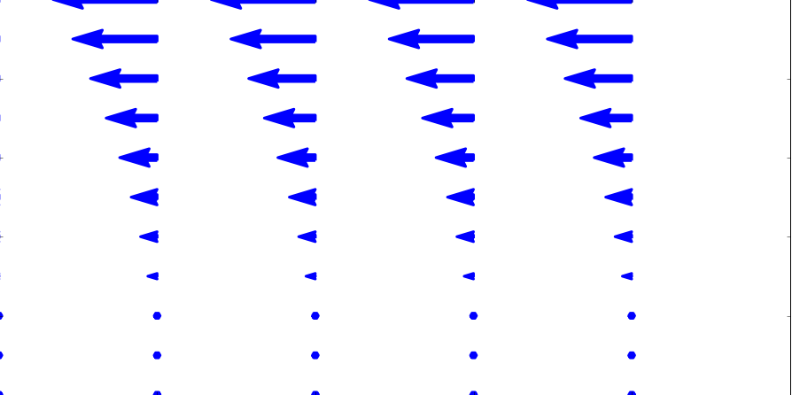
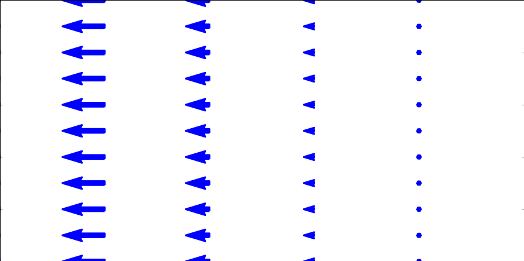

<!--
_class: title
_backgroundColor: #ffffff
_color: #18453B
-->

# Day 13 - Conservative Forces

$$\vec{F} = - \nabla U$$
$$U = - \int \vec{F} \cdot d\vec{r}$$
$$\nabla \times \vec{F} = 0$$

---

## Announcements

* **Homework 4 is posted** (due Friday; late after Sunday)
* **First midterm is posted** (assigned Monday, 16 Feb)
* **There will be no class/office hours on Friday** 
    * Observance plans are posted on Spartans Together: <https://spartanstogether.msu.edu/plans-feb-13-2026>
* **Need help this week?** Make an appointment with Danny: <https://cal.com/dannycaballero/phy-321>
* We will work Exercise 2 and 3 from Homework 4 in class today

---

## Reminder of our Midterm Procedures

* The take-home midterms will be open for almost two weeks; you can often start some exercises early as they cover older material.
* They are meant to be challenging, but we will provide you with the resources and support you need to complete them.
* There is no homework due during the period in which the midterm is assigned.
* In contrast to homework assignments, DC will not work any exercises directly

You may work closely together with me, Mihir, and your classmates, but you and your partner must write up your own solutions.

---

## Seminars this week

### WEDNESDAY, February 11, 2026    
 
Astronomy Seminar, 1:30 p.m., BPS 1400 & Zoom 
Speaker: Evan Kirby, Notre Dame
Title: TBA
Zoom Link: https://msu.zoom.us/j/93334479606?pwd=OtIXPWhRPBfzYu53sl3trSJlaBYI7C.1
Passcode:  825824

---

## Seminars this week

### WEDNESDAY, February 11, 2026   
 
FRIB Nuclear Science Seminar, 3:30 p.m., FRIB 1300 & Zoom
Speaker: Kyle Godbey, FRIB
Title: What’s Driving the New Era of Discovery in Nuclear Science?
Zoom Link: https://msu.zoom.us/j/99975564296?pwd=e3puzoZ4Yu7m6CiCf7SWiaKjvxgCwu.1
Passcode: 569117
 
---

## Seminars this week

### FRIDAY, February 13, 2026    
 
IReNA Online Seminar, 2:00 pm, Zoom
Light refreshments at 1:50pm in 2025 Nuclear Conference Room - FRIB
Hosted by: Artemis Tsantiri (University of Regina, Canada)
Speaker: Thanassis Psaltis, Saint Mary’s University - Canada
Title: Nuclear physics constraints on the γ-ray signatures of core-collapse supernovae
Zoom Link: https://msu.zoom.us/j/827950260
Password: CENAM

---

## This Week's Goals

* Remind ourselves of the concept of energy and energy conservation
* Apply the conservation of energy to a variety of systems
* Develop the mathematical tools to analyze energy conservation in more complex systems
* Connect our new understanding of energy conservation to our previous work on forces and motion

---

# Reminders

* Energy is conserved in every process; our choice of system determines how we account for energy.
* Closed, isolated systems are often the simplest to analyze.
* A point particle is a model that allows us to ignore the internal structure of an object.
* The Work-Energy Theorem is just a statement of the conservation of energy for a point particle.

---

## Conservation of Energy

**General Principle**: Energy is conserved in every process.

$$\Delta E_{sys} = W + Q$$

**Isolated System**: No work or heat is exchanged with the surroundings.

$$\Delta E_{sys} = 0$$

**Point Particle**: A model that allows us to ignore the internal structure of an object.

$$\Delta K =  W_{\text{ext}}$$

---

## The Potential Energy Function (SHO, $F_{s} = -kx$)

$$\Delta K = W_{s}$$

$$\dfrac{1}{2} m v_f^2 - \dfrac{1}{2} m v_i^2 = \int_{x_i}^{x_f} F_s dx = - \int_{x_i}^{x_f} kx dx$$

$$\dfrac{1}{2} m v_f^2 - \dfrac{1}{2} m v_i^2 = - \dfrac{1}{2} k x_f^2 + \dfrac{1}{2} k x_i^2$$

$$\dfrac{1}{2} m v_f^2 + \dfrac{1}{2} k x_f^2 = \dfrac{1}{2} m v_i^2 + \dfrac{1}{2} k x_i^2$$

$$K_f + U_{s,f} = K_i + U_{s,i}$$

$$U_s = \dfrac{1}{2} k x^2$$

---

## Clicker Question 13-1

The gravitation force near the Earth's surface is given by $\vec{F} = -mg\hat{z}$. What is the potential energy function for this force? Choose $+\hat{z}$ to be up.

1. $U = -mgz$
2. $U = mgz$
3. $U = -mgz + U_0$
4. $U = mgz + U_0$
5. None of the above

---

## Clicker Question 13-2

A model for a lattice chain acting on a electron is given by $F(x) = - F_0 \sin\left(\frac{2\pi x}{b}\right)$. What is the potential energy function for this force?

1. $U = -F_0 \cos\left(\frac{2\pi x}{b}\right)$
2. $U = F_0 \cos\left(\frac{2\pi x}{b}\right)$
3. $U = -\frac{F_0 b}{2\pi} \cos\left(\frac{2\pi x}{b}\right)$
4. $U = \frac{F_0 b}{2\pi} \cos\left(\frac{2\pi x}{b}\right)$
5. None of the above

---

## Clicker Question 13-3

The curl of a vector field is given by $\nabla \times \vec{F}$. 

If the curl of a vector field is zero, what can we say about the vector field?

1. It is a conservative force
2. It is a non-conservative force
3. It is a constant force
4. It is a force that does no work
5. Some combination of the above

--- 

## Clicker Question 13-4

Which of the following fields have no divergence?

  A. 
  B. 

1. A
2. B
3. Both A and B
4. Neither A nor B

---

## Clicker Question 13-5

Which of the following fields have no curl?

  A. 
  B. 

1. A
2. B
3. Both A and B
4. Neither A nor B

---

## Clicker Question 13-6

Consider a vector field with zero curl: $\nabla \times \vec{F} = 0$. Which of the following statements is true?

1. The field is conservative
2. $\int \nabla \times \vec{F} \cdot d\vec{A} = 0$
3. $\oint \vec{F} \cdot d\vec{r} \neq 0$
4. $\vec{F}$ is the gradient of some scalar function, e.g., $\vec{F} = - \nabla U$
5. Some combination of the above

---

## HW 4 Exercise 2, Sliding puck

A small puck rests on a fixed sphere of radius $R$. The puck is given a tiny nudge and it slides down the sphere. Using conservation of energy, we can determine the point at which the puck leaves the sphere.

* 2a Setup the problem with a sketch. Explain the setup and include any assumptions that you need to make in order to solve the problem analytically. Identify the height as a function of the polar angle, $h(\theta)$. What is the maximum possible angle $\theta$ that the puck could reach before falling off? Why?

---

## HW 4 Exercise 2, Sliding puck

A small puck rests on a fixed sphere of radius $R$. The puck is given a tiny nudge and it slides down the sphere. Using conservation of energy, we can determine the point at which the puck leaves the sphere.

* 2b Use conservation of energy to find the speed of the puck as a function of it's height. Your answer should be in terms of the polar angle, $\theta$.
* 2c Use Newton's Second Law to find the normal force acting on the puck as a function of it's height. Your answer should be in terms of the polar angle, $\theta$. What is the condition for the puck to leave the sphere?

---

## HW 4 Exercise 2, Sliding puck

A small puck rests on a fixed sphere of radius $R$. The puck is given a tiny nudge and it slides down the sphere. Using conservation of energy, we can determine the point at which the puck leaves the sphere.

* 2d At what angle and height does the puck leave the sphere? 

---

## HW 4 Exercise 3, Example of potential

Consider a particle of mass $m$ moving according to the potential:

$$
V(x,y,z)=A\exp\left\{-\frac{x^2+z^2}{2a^2}\right\}.
$$

We can think of this potential as the energy landscape of a particle in three dimensions. That is, you can imagine a particle moving around this potential like a ball rolling around a landscape. That analogy is not perfect, but it is a good way to help us think about stability and equilibrium.

* 3a Plot this potential or sketch a plot of it. You can use perspective plots, contour plots or any other plot you find useful.

---

## HW 4 Exercise 3, Example of potential

Consider a particle of mass $m$ moving according to the potential:

$$
V(x,y,z)=A\exp\left\{-\frac{x^2+z^2}{2a^2}\right\}.
$$

* 3b What are some feature you notice with this potential? What happens when you change $A$ and $a$?
* 3c Imagine a particle moving in this potential, what are some expected trajectories?

---

## HW 4 Exercise 3, Example of potential

Consider a particle of mass $m$ moving according to the potential:

$$
V(x,y,z)=A\exp\left\{-\frac{x^2+z^2}{2a^2}\right\}.
$$

* 3d Do there appear to be any equilibrium points? If so, are they stable or unstable?
* 3e Is the resulting force conservative? Why? 

