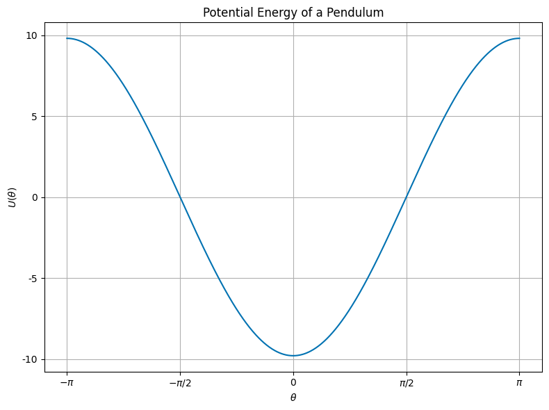
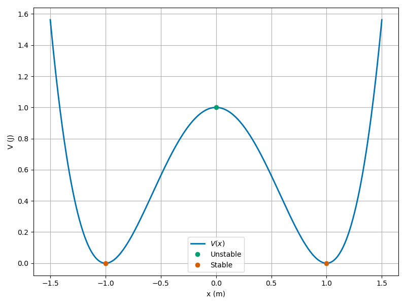

# Day 15 - Potential Energy and Stability

Mexican Hat/Sombrero Potential $\longrightarrow$

---

# Mexican Hat Potential

$V(\phi) = -5|\phi|^2 + |\phi|^4$

- [Spontaneous Symmetry Breaking](https://en.m.wikipedia.org/wiki/Spontaneous_symmetry_breaking#Sombrero_potential) ([Jeffery Goldstone, 1961](https://en.m.wikipedia.org/wiki/Jeffrey_Goldstone))
- Unstable vacuum state at $\phi = 0$
    - Peak of the hat
- Infinite number of stable minima 
    - $\phi = \sqrt{5/2}e^{i\phi}$

---

# Announcements

- HW 4 is due today
- Midterm 1 is available today (Due Feb 24th)

---

# Seminars this week

---

# This Week's Goals

- Understand the concept of potential energy
- Determine the equilibrium points of a system using potential energy
- Analyze the stability of equilibrium points
- Define and begin to apply conservation of linear and angular momentum

---

# Reminders: Conservative Forces

- Conservative forces are those with zero curl

$$\nabla \times \vec{F} = 0$$

- The work done by a conservative force is path-independent; on a closed path, the work done is zero

$$\oint \vec{F} \cdot d\vec{r} = 0$$

- The force can be written as the gradient of a scalar potential energy function

$$\vec{F} = - \nabla U$$

---

# Clicker Question 15-1

Here's the graph of the potential energy function $U(x)$ for a pendulum.

What can you say about the equilibrium points? There is/are:

1. One stable point
2. Two stable points
3. One stable and one unstable point
4. Two unstable and one stable point

---

# Clicker Question 15-2

Here's a potential energy function $U(x)$ for a pendulum:

$$U(\phi) = -mgL\cos(\phi) + U_0$$

1. Find the equilibrium points ($\phi^*$) of the pendulum by setting:

$$\frac{dU(\phi^*)}{d\phi} = 0.$$

2. Characterize the stability of the equilibrium points ($\phi^*$) by examining the second derivative:

$$\frac{d^2U(\phi^*)}{d\phi^2}>0? \qquad \frac{d^2U(\phi^*)}{d\phi^2}<0?$$

**Click when done.**

---

## Clicker Question 15-3

A double-well potential energy function $U(x)$ is given by

$$U(x) = -\frac{1}{2}kx^2 + \frac{1}{4}kx^4.$$

*We assume we have scaled the potential energy so that all the units are consistent.*

How many equilibrium points does this system have?

1. 1
2. 2
3. 3
4. 4

---

# Clicker Question 15-4

A double-well potential energy function $U(x)$ is given by

$$U(x) = -\frac{1}{2}kx^2 + \frac{1}{4}kx^4.$$

1. Find the equilibrium points ($x^*$) of the pendulum by setting:

$$\frac{dU(x^*)}{dx} = 0.$$

2. Characterize the stability of the equilibrium points ($x^*$) by examining the second derivative:

$$\frac{d^2U(x^*)}{dx^2}>0? \qquad \frac{d^2U(x^*)}{dx^2}<0?$$

**Click when done.**

---

# Clicker Question 15-5

Here's a graph of the potential energy function $U(x)$ for a double-well potential.

Describe the motion of a particle with the total energy, $E=$

1. $0.4\,\mathrm{J}$, $<$ barrier height
2. $1.2\,\mathrm{J}$, $>$ barrier height
3. $1.0\,\mathrm{J}$, $=$ barrier height

**Click when done.**